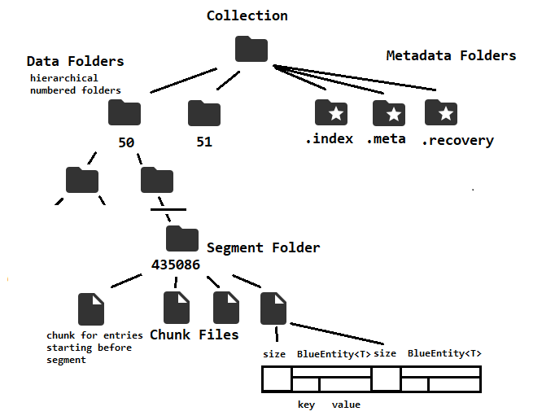

# Gradle Projects

BlueDB subproject has classes for external use: interfaces, key classes, etc.  BlueDbOnDisk project is the implementation.

# Unit Tests

We've so far kept unit test coverage at 100%.  This makes it so that any time we write untested code, it stands out.

# ReadOnly vs ReadWrite

Many implementation classes are broken up into ReadOnly and ReadWrite.  This is to prevent it from even being possible to write from a ReadOnly database.

Readable classes are abstract classes with functionality shared between ReadOnly and ReadWrite classes.

# Segments, Grouping Numbers

The data is broken into segments.  Each segment has an id that is a non-negative integer.  For time-based collections, the default size of a segment is one hour and segment 0 is the first hour UTC of 1970.

To assign keys to a segment, we have a concept called "grouping number".  For time-based collections, the grouping number is epoch-ms.  So a one-hour segment in a time collection is 3,600,000 grouping numbers.  And to figure out which segment a particular time belongs to, just divide the epoch-ms by 3,600,000.

# Collections, Metadata, Segment/Data Folders

Each collection has its own root folder.  In that root folder is:
- .index : indexes
- .meta : collection metadata
- .recovery : copies of the last several changes made, to recover the collection to a consistent state
- numbered data folders : these represent the contents of the collection, are organized into a hierarchy

The numbered data folders are organized into a hierarchy.  At the smallest folder level, each folder represents a segment and the directory names are the segment ids.  The SegmentPathManager classes figure out the hierarchical structure of the data folders.

# Metadata, FST, Serialized Classes

When we serialize an object, we need to know what class is the serialized object in order to deserialize it.

We could store the canonical name (e.g. "java.util.LinkedList").  But to save space and time, FST maps the canonical names to a number.

This mapping can vary from one bluedb to another for the same application, as the order that classes are added might be different.  So it's important that this not get deleted or corrupted.

# Writes, Recovery

BlueDB only allows a single thread per collection for writing.  This greatly simplifies concurrency but results in slow write speeds.  Note that rollups are treated the same as any other write.

To make a change, a QueryTask (extends Runnable) is submitted to the executor in the ReadWrite collection implementation class.

When the QueryTask is executed, it:
1. performs any reads it needs,
2. calculates the changes,
3. creates a Recoverable object (a Serializable representing the change),
4. saves that Recoverable to a timestamped file in the recovery folder,
5. executes the changes in the Recoverable in an idempotent way, and
6. marks the Recoverable in the recovery folder as completed.

If a failure occurs during a write, there's a timestamped Recoverable object saved in the .recovery folder.  On startup, bluedb executes those recoverables, in order.  Because they are idempotent (and every step of their execution is designed to be idempotent), they should restore BlueDB to a consistent state no matter at which state they fail and even if BlueDB fails to start multiple times.

# Locks and Concurrency

Locks are handled by the LockManager.

No file system locks are used.

Writes only get a lock on a file with no other locks on it.  Reads can add a read lock to a file that has another read lock on it, but not another write lock on it.

# Segments, Chunks, Rollups

Each segment is represented by a folder.  Within each folder, there can be many files called chunks.

Each chunk represents a range of grouping numbers.  When a new object is written, it is written to the existing chunk if one exists.  If an appropriate chunk doesn't exist, a new chunk of size 1 is created.

Small chunks that haven't been touched for a while get rolled up.  Writes and reads are reported to the RollupScheduler which schedules the rollups when needed.

Rollups are treated like any other write.

Rollups must be idempotent so that BlueDB can recover if there is a crash in the middle of a rollup.

# Iterators

BlueDB uses iterators a lot.

The iterators handle all of the complexity of figuring out which segments to read/write to and which chunks in those segments to read, and reading and deserializing the objects in that chunk.

A StreamingWriter or a Query can lean on those iterators to do all that and just focus on their own job.

# Temporary Files

When we write to a file, we first write to a temporary file.  Then we acquire a write lock on the target file and do an atomic rename (supported by the OS) to swap in the temp file for the target file.

These temporary files might accumulate if there's lots of crashes.  They're garbage and we can ignore them.

# Serialization

We use FST to serialize the data.  FST has some issues so we use an adapter class, BlueSerializer, to make it easier to adjust to FST's issues.

Data are serialized in a BlueEntity, which contains the key and the value.

The data are actually physically stored in a form like:

\[size in bytes]\[BlueEntity]\[size in bytes]\[BlueEntity]...

# Indexes

Index data are stored the same as the underlying data - in hierarchical folders, using grouping numbers, using BlueEntity, etc.

The value in the BlueEntity in an index is a key to find the underlying value.
